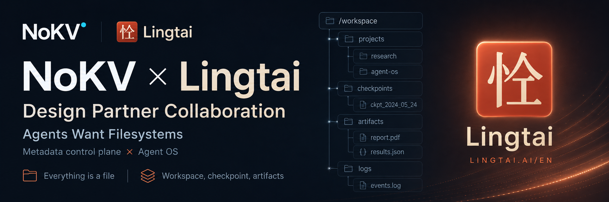

  

# NoKV × Lingtai: a design-partner collaboration

Today we're sharing that **NoKV** and **Lingtai** ([Lingtai-AI/lingtai](https://github.com/Lingtai-AI/lingtai)) have begun a **design-partner collaboration**. What you're reading is just the warm-up announcement. Before there's much to show, we wanted to mark the start.

## Two projects, one conviction: agents want filesystems

- **Lingtai** (灵台) is a local-first agent runtime built on the idea that *"the project organization is the product."* Its agents are long-lived residents with on-disk homes: state, mailboxes, logs, and artifacts all live as plain files you can `ls`, `cat`, and `grep`. State on disk, on purpose. Its name comes from the Zhuangzi (*the heart-mind, the square inch where transformation begins*), and it frames itself as *"an Agent OS that gifts life,"* where *"all things are files" (万物皆文件)*. Today Lingtai already has an active early community of 240+ users.
- **NoKV** is a metadata control plane for object-backed agent artifacts: run outputs, logs, checkpoints, and citable evidence in one filesystem-shaped namespace, with atomic publish-by-generation, GC-protected snapshots, and immutable versioned blocks underneath.

*"All things are files"* on one side, *"agents want filesystems"* on the other: we reach the same conviction from two layers. Lingtai gives agents a filesystem-shaped *home*; NoKV is building the durable *substrate* a home like that can stand on.

## What we're exploring together

This is design work, not a shipped integration. Abstractly:

- **Workspace checkpoints**: let a long-running agent roll its whole workspace back to a known-good state instead of starting over.
- **Atomic, crash-consistent publishing**: concurrent agent writes and a mid-run crash never leave a half-written workspace.
- **Artifact provenance**: versioned blocks with digests, so a derived artifact stays traceable to the run that produced it.
- **A queryable metadata layer**: ask *"what produced this / what depends on this"* across an agent's outputs.

The constraint we care about most is preserving the plain-file transparency Lingtai is built on. A substrate underneath should *add* durability, snapshots, and provenance, without taking away the `ls`/`cat`/`grep` you can already point at your agents' state.

## Where things stand

Both projects are pre-1.0 and moving fast, so treat this as a forward-looking partnership. We're sharing it now because the direction is the most interesting part, and because we believe in the power of an open-source community.

If a stateful, snapshot-able, auditable agent workspace is something you've wanted: ⭐ star NoKV, follow [Lingtai](https://github.com/Lingtai-AI/lingtai), and watch this space. More as the work takes shape.

## Contact

- NoKV: hello@nokv.io
- Lingtai: lingtai2026@gmail.com

## Join the community

- Discord (NoKV): https://discord.gg/c5PZapnwPh
- Slack (NoKV): the NoKV channel in the CNCF community Slack (join at https://slack.cncf.io, then open https://cloud-native.slack.com/archives/C0BBDBYE3H6 )
- WeChat group (Lingtai): email lingtai2026@gmail.com for community details
