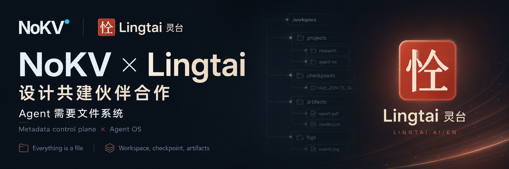

  

# NoKV × Lingtai：design-partner 合作正式启动

今天我们想分享一个消息：**NoKV** 与 **Lingtai**（[Lingtai-AI/lingtai](https://github.com/Lingtai-AI/lingtai)）已经开始一段 **design-partner（设计共建伙伴）合作**。你看到的只是一封预热公告。在还没有太多可展示的东西之前，我们想先把“起点”记下来。

## 两个项目，一个共识：agent 想要的是文件系统

- **Lingtai（灵台）** 是一个 local-first 的 agent 运行时，核心理念是 *“项目的组织方式本身就是产品”*。它的 agent 是拥有磁盘“家目录”的常驻进程：状态、信箱、日志、产物都以纯文本文件的形式存在，你可以直接用 `ls`、`cat`、`grep` 查看。状态刻意落在磁盘上。它的名字取自庄子“灵台，心也”（那方寸之地，变化由此而生），并自我定位为一个 *“赋予智能体生命的 Agent OS”*，信奉 *“万物皆文件”*。目前，Lingtai 已经拥有一个有 240+ 用户的活跃早期社区。
- **NoKV** 是面向对象存储 agent 工件的元数据控制面（metadata control plane）：把运行输出、日志、检查点（checkpoint）和可引用证据收进同一个文件系统形态的命名空间，底层提供原子的按代发布（publish-by-generation）、受 GC 保护的快照，以及不可变、带版本的数据块。

一边是 *“万物皆文件”*，一边是 *“agent 想要的是文件系统”*：我们从两个不同的层次抵达同一个共识。Lingtai 给 agent 一个文件系统形态的*家*；NoKV 想做的，是这样一个家能够稳稳立足其上的持久化*基座*。

## 我们要一起探索什么

这是设计阶段的工作，还不是已落地的集成。先抽象地说：

- **工作区检查点（workspace checkpoint）**：让长时间运行的 agent 把整个工作区回滚到某个已知良好的状态，而不是从零重来。
- **原子、崩溃一致的发布**：并发的 agent 写入，或运行中途崩溃，都不会留下写到一半的工作区。
- **工件溯源（artifact provenance）**：带摘要（digest）的版本化数据块，让每一个派生工件都能追溯到产生它的那次运行。
- **可查询的元数据层**：在 agent 的产物之间提问 *“这是什么产生的 / 什么依赖了它”*。

我们目前最在意的约束就是保住 Lingtai 赖以立身的“纯文件透明性”。底层基座应当*增加*持久性、快照与溯源能力，而不能拿走你本来就能对着 agent 状态敲的那一行 `ls`/`cat`/`grep`。

## 目前进展

两个项目都还在 pre-1.0 阶段、迭代很快，所以请把它当作一段面向未来的合作。我们现在就分享出来，是因为“方向”本身才是最有意思的部分，也因为我们足够相信开源社区的力量。

如果“一个有状态、可快照、可审计的 agent 工作区”正是你一直想要的：给 NoKV 点个 ⭐，关注 [Lingtai](https://github.com/Lingtai-AI/lingtai)，留意后续。工作展开后我们会陆续分享更多。

## 联系方式

- NoKV：hello@nokv.io
- Lingtai：lingtai2026@gmail.com

## 加入社群

- Discord（NoKV）：https://discord.gg/c5PZapnwPh
- Slack（NoKV）：CNCF 社区 Slack 中的 NoKV 频道（先在 https://slack.cncf.io 加入，再进频道 https://cloud-native.slack.com/archives/C0BBDBYE3H6 ）
- 微信群（Lingtai）：请发送邮件到 `lingtai2026@gmail.com` 获取社群信息
